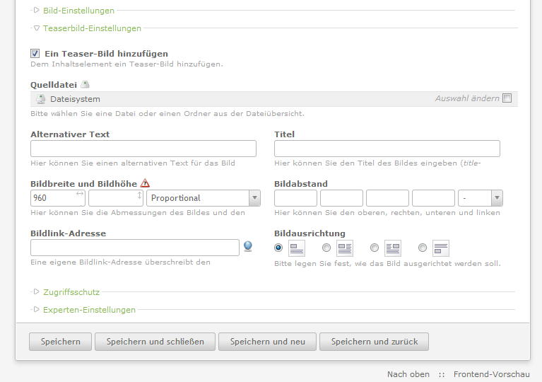
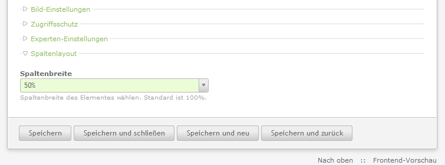

# TheRemoteCoderContentElements

- [About](#about)
- [Examples](#examples)
- [How to use](#how-to-use)

---

 

## About

Extend some default Contao CMS elements that cannot be extended by DCA modifications only.

### Accordion (Single element)

- Added an optional 'Teaser image' field. Usage example: If you need to show a small image within the toggle that's different from the full version within the content. Requires custom template modification.
- See Screenshot: `addImageTeaser.png`

### Text

- Added an option to set the elements width for multi-column layouts. Requires custom template modification.
- See Screenshot: `textColumnSettings.png`

## Examples

  

## How to use

Copy the files into Contao's module folder. Refresh any caches and test if the content elements are still working.

Requirements:

- Tested with Contao 2.11.7

