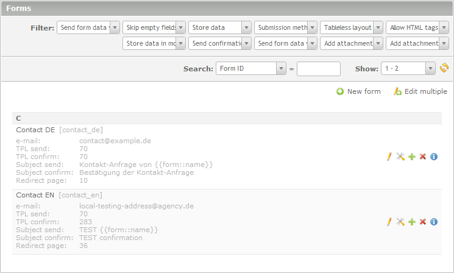

# TheRemoteCoderFormListInfo

- [About](#about)
- [Examples](#examples)
- [How to use](#how-to-use)

 

## About

Adds most important form settings to the overview list, which is especially helpful for development and QA checks. Works with and without installation of the EFG module (Extended Form Generator).

## Examples

### EFG module

  

## How to use

Just copy this folder to `/system/modules/` and open or reload the forms module in your backend. Contao 3+ needs the internal caches to be refreshed for every change.

 

Installation of the EFG module (Extended Form Generator) is highly recommended but not required.

Requirements:

- Tested with Contao 2.11.10 - 3.0.5

