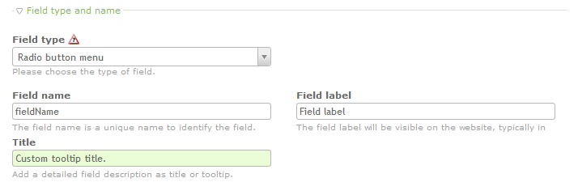

# TheRemoteCoderFormTooltipTitle / Readme

- [About](#about)
- [Examples](#examples)
- [How to use](#how-to-use)

 

## About

Adds a custom title field to most backend form fields. Intended use: Add title tags to form fields in the frontend and use it as styled tooltip.

  

## Examples

  

## How to use

Copy the files into Contao's module folder. Refresh any caches and test if the content elements are still working.

Requirements:

- Tested with Contao 3+

